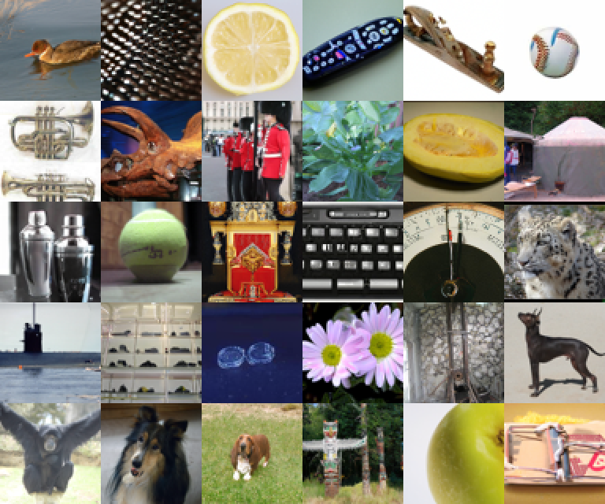
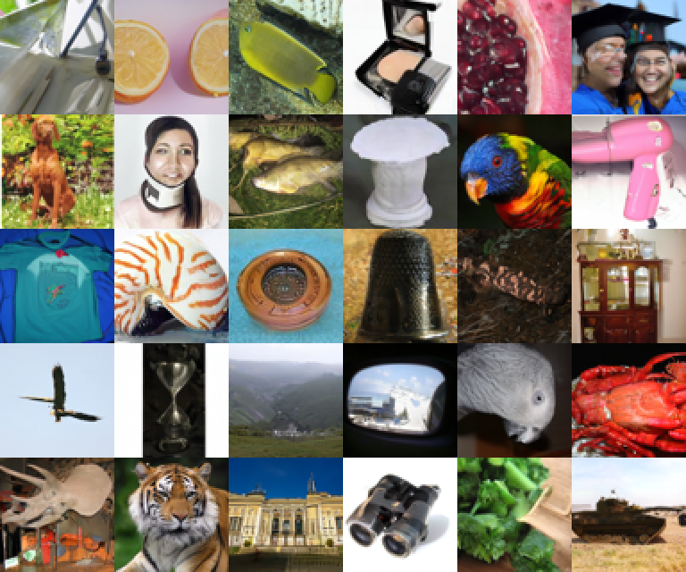

# Stable Continuous-Time Consistency Distillation

Code and checkpoints for

**Stable Continuous-Time Consistency Distillation: An Empirical Study with a Multistep Extension**<br>
Vinay Saji Mathew, Soundar R. Kumara, Gretta D. Kellogg, William KM Lai<br>
*Transactions on Machine Learning Research*, 2026. [OpenReview](https://openreview.net/forum?id=di6ofoWEU8)

| TrigFlow teacher, 63 NFE | sCD student, 2 NFE |
|---|---|
|  |  |

Uncurated class-conditional ImageNet-64 samples from the released checkpoints (EDM2-S backbone, no guidance), from the paper's appendix.

This repository is a fork of [NVlabs/edm2](https://github.com/NVlabs/edm2). EDM2 is retired upstream, and this fork holds the code for the paper: a TrigFlow/sCM reimplementation on EDM2, the multistep extension MS-sCD, and the MSCD and moment-matching baselines. The original EDM2 README is in [docs/README_EDM2.md](docs/README_EDM2.md). The upstream tools (`train_edm2.py`, `reconstruct_phema.py`, `dataset_tool.py`, `toy_example.py`) are unchanged.

Checkpoints and FID reference statistics: [huggingface.co/vinaymatt/edm2_sCM](https://huggingface.co/vinaymatt/edm2_sCM).

## Setup

Python 3.9 and PyTorch 2.1 or later, plus

```bash
pip install click Pillow psutil requests scipy tqdm importlib_metadata "huggingface_hub[cli]"
```

The [Dockerfile](Dockerfile) from EDM2 also works. All commands run on one GPU, or on a whole node through `torchrun --standalone --nproc_per_node=<GPUS>`.

## Checkpoints

```bash
hf download vinaymatt/edm2_sCM --local-dir checkpoints
```

FID is computed in-process from 50k samples, so no images are written to disk:

```bash
python calculate_metrics.py gen --net=checkpoints/<NET> --ref=checkpoints/fid_refs/<REF> \
    --metrics=fid --num=50000 --seed=0 --batch=<BATCH> <SAMPLER FLAGS>
```

Use `--batch=512` for CIFAR-10 and `--batch=128` for ImageNet-64. The paper reports the best FID over a sweep of generator seeds, so `--seed=0` lands close to the table value rather than on it. The appendix lists the mean and standard deviation over seeds.

CIFAR-10, unconditional, DDPM++ backbone. Reference: `fid_refs/cifar10-32x32.npz`.

| Model | `--net` | Sampler flags | NFE | FID |
|---|---|---|---|---|
| TrigFlow teacher | `cifar10/teacher/BEST_TEACHER.pkl` | `--sampler=trigflow --steps=18` | 35 | 2.08 |
| sCD | `cifar10/scd/network-snapshot-0071303-val.pkl` | `--sampler=scm --steps=1` | 1 | 3.59 |
| sCD | same | `--sampler=scm --steps=2` | 2 | 2.39 |
| sCT | `cifar10/sct/phema-0203423-0.075.pkl` | `--sampler=scm --steps=1` | 1 | 2.88 |
| sCT | same | `--sampler=scm --steps=2` | 2 | 2.09 |

ImageNet-64, class-conditional, EDM2-S backbone, no guidance. Reference: `fid_refs/edm2_img64_custom_ref.pkl`. This is our own set of training-set statistics; other ImageNet-64 references give different numbers.

| Model | `--net` | Sampler flags | NFE | FID |
|---|---|---|---|---|
| TrigFlow teacher | `imagenet64/teacher/phema-2135162-0.114.pkl` | `--sampler=trigflow --steps=32` | 63 | 1.83 |
| sCD | `imagenet64/scd/phema-0817889-0.080-best-1step.pkl` | `--sampler=scm --steps=1` | 1 | 3.59 |
| sCD | same | `--sampler=scm --steps=2` | 2 | 2.66 |
| sCT | `imagenet64/sct/phema-0817889-0.080.pkl` | `--sampler=scm --steps=1` | 1 | 4.34 |
| sCT | same | `--sampler=scm --steps=2` | 2 | 3.98 |
| MS-sCD, M=2 | `imagenet64/ms_scd_m2/network-snapshot-0289406-val.pkl` | `--sampler=ms_scd --steps=2` | 2 | 2.53 |
| MS-sCD, M=4 | `imagenet64/ms_scd_m4/network-snapshot-0230686-val.pkl` | `--sampler=ms_scd --steps=4` | 4 | 2.26 |
| MS-sCD, M=8 | `imagenet64/ms_scd_m8/phema-0293601-0.020.pkl` | `--sampler=ms_scd --steps=8` | 8 | 2.08 |
| MSCD, M=2 | `imagenet64/mscd_m2/network-snapshot-0204800.pkl` | `--sampler=euler --step-sigmas=80,1.1,0` | 2 | 3.44 |
| MSCD, M=4 | `imagenet64/mscd_m4/network-snapshot-0174080.pkl` | `--sampler=euler --steps=4` | 4 | 2.32 |
| MSCD, M=8 | `imagenet64/mscd_m8/network-snapshot-0101376.pkl` | `--sampler=euler --steps=8` | 8 | 1.79 |

The moment-matching student (EDM ADM backbone) is evaluated against EDM's ImageNet-64 reference, `--ref=https://nvlabs-fi-cdn.nvidia.com/edm/fid-refs/imagenet-64x64.npz`:

| Model | `--net` | Sampler flags | NFE | FID |
|---|---|---|---|---|
| Moment matching, 8 steps | `imagenet64/mm_s8/network-snapshot-212994.pkl` | `--sampler=ancestral --steps=8` | 8 | 1.4 |

Sampler notes:

- `trigflow` is DPM-Solver-2S (`--order=2`, the default), with NFE = 2 x steps - 1.
- `scm` is the sCM consistency sampler. The 2-step variant re-noises at `--t_mid=1.1` (the default).
- `ms_scd` runs one network evaluation per segment, with `--steps` = M.
- `ancestral` is the stochastic few-step sampler used by moment matching.
- `euler` is the few-step EDM sampler used by MSCD. M=2 uses the explicit grid `80, 1.1, 0` from the paper; M=4 and M=8 use the Karras grid.

`calculate_metrics.py` fetches the Inception network from NVIDIA on first use. On nodes without internet access, point `EDM_INCEPTION_PATH` at a local copy of `inception-2015-12-05.pkl`.

To make images instead of FID:

```bash
python generate_images.py --net=checkpoints/imagenet64/ms_scd_m8/phema-0293601-0.020.pkl \
    --sampler=ms_scd --steps=8 --seeds=0-63 --outdir=out
```

## Datasets

Datasets are EDM2-style ZIP archives made with `dataset_tool.py`.

```bash
# CIFAR-10 (https://www.cs.toronto.edu/~kriz/cifar-10-python.tar.gz)
python dataset_tool.py convert --source=cifar-10-python.tar.gz --dest=datasets/cifar10-32x32.zip

# ImageNet-64 for the TrigFlow and EDM2-S models
python dataset_tool.py convert --source=downloads/imagenet/ILSVRC/Data/CLS-LOC/train \
    --dest=datasets/img64.zip --resolution=64x64 --transform=center-crop-dhariwal
```

Students must be trained on data prepared the same way as their teacher. The EDM ADM teacher used by the moment-matching baseline was trained on EDM's standard center crop (`--transform=center-crop`), not the Dhariwal crop used by EDM2.

To compute reference statistics for a new dataset:

```bash
python calculate_metrics.py ref --data=datasets/img64.zip --dest=img64-ref.pkl
```

## Training

The presets reproduce the paper's runs. Batch sizes are global, and `--batch-gpu` only sets the per-GPU chunk for gradient accumulation. `--val-ref` (`--val_ref` for MSCD and moment matching) turns on 50k-sample FID at each snapshot. For ImageNet-64 use `checkpoints/fid_refs/edm2_img64_custom_ref.pkl`, and for CIFAR-10 `checkpoints/fid_refs/cifar10-32x32.npz`. Add `--dry-run` to print the resolved options without training.

### TrigFlow teachers

```bash
torchrun --standalone --nproc_per_node=8 train_trigflow.py --preset=trigflow-cifar10 \
    --data=datasets/cifar10-32x32.zip --outdir=runs/cifar10-teacher --batch-gpu=64

torchrun --standalone --nproc_per_node=8 train_trigflow.py --preset=trigflow-img64-s \
    --data=datasets/img64.zip --outdir=runs/img64-teacher --batch-gpu=32
```

CIFAR-10 trains unconditionally in FP32, and ImageNet-64 class-conditionally in BF16. Other presets: `trigflow-img64-{m,l,xl}`. Post-hoc EMA profiles are reconstructed with `reconstruct_phema.py` as in EDM2. The released ImageNet-64 teacher is the phEMA reconstruction at 0.114.

### sCD and sCT

```bash
torchrun --standalone --nproc_per_node=8 train_trigflow_scm.py --preset=scm-img64-s-scd \
    --data=datasets/img64.zip --teacher=checkpoints/imagenet64/teacher/phema-2135162-0.114.pkl \
    --outdir=runs/img64-scd --batch-gpu=32
```

Presets: `scm-img64-s-scd`, `scm-img64-s-sct`, `scm-cifar10-scd`, `scm-cifar10-sct`. The CIFAR-10 presets take `--teacher=checkpoints/cifar10/teacher/BEST_TEACHER.pkl`. sCT reads the teacher only for its architecture and initialization.

### MS-sCD

```bash
torchrun --standalone --nproc_per_node=8 train_trigflow_ms_scd.py --preset=ms-scd-img64-s-scd --M=8 \
    --data=datasets/img64.zip --teacher=checkpoints/imagenet64/teacher/phema-2135162-0.114.pkl \
    --outdir=runs/img64-msscd-m8 --batch-gpu=32
```

`--M` sets the number of segments (the paper uses 2, 4 and 8). The CIFAR-10 variants are `ms-scd-cifar10-scd` and `ms-scd-cifar10-sct`.

### MSCD baseline

MSCD distills NVIDIA's EDM2-S ImageNet-64 model ([edm2-img64-s-1073741-0.075.pkl](https://nvlabs-fi-cdn.nvidia.com/edm2/posthoc-reconstructions/edm2-img64-s-1073741-0.075.pkl)):

```bash
torchrun --standalone --nproc_per_node=8 train_mscd.py --preset=mscd-img64-edm2-s --S=8 \
    --data=datasets/img64.zip --teacher=edm2-img64-s-1073741-0.075.pkl \
    --outdir=runs/img64-mscd-m8 --batch-gpu=64
```

For M=2, use `--S=2 --student_sigma_mids=1.1`. The `mscd-img64-edm` preset runs the same method on the EDM ADM backbone.

### Moment matching

Moment matching distills NVIDIA's EDM ADM ImageNet-64 model ([edm-imagenet-64x64-cond-adm.pkl](https://nvlabs-fi-cdn.nvidia.com/edm/pretrained/edm-imagenet-64x64-cond-adm.pkl)) on EDM-cropped data:

```bash
torchrun --standalone --nproc_per_node=8 train_momentmatch.py --preset=mm-img64-edm --S=8 \
    --data=datasets/imagenet-64x64.zip --teacher=edm-imagenet-64x64-cond-adm.pkl \
    --outdir=runs/img64-mm --batch-gpu=64
```

Use EDM's ImageNet-64 reference (see above) for `--val_ref`, and sample the student with `--sampler=ancestral --steps=8`.

## Code

| Path | Contents |
|---|---|
| `train_trigflow.py`, `train_trigflow_scm.py`, `train_trigflow_ms_scd.py` | TrigFlow teacher, sCD/sCT and MS-sCD trainers |
| `train_mscd.py`, `train_momentmatch.py` | MSCD and moment-matching trainers |
| `training/networks_trigflow.py`, `training/networks_trigflow_ddpmpp.py` | TrigFlow networks on EDM2 (ImageNet-64) and DDPM++ (CIFAR-10) |
| `training/loss_scm.py`, `training/loss_ms_scm.py`, `training/segment_schedule.py` | sCM and MS-sCD losses and segment schedules |
| `training/distillation/` | MSCD and moment-matching losses and training loops |
| `training/networks_edm.py`, `training/augment.py` | EDM networks and augmentation, from [NVlabs/edm](https://github.com/NVlabs/edm) |
| `generate_images.py`, `calculate_metrics.py`, `validation.py` | Samplers, FID, and in-training FID |

## License

CC BY-NC-SA 4.0, as for EDM and EDM2 ([LICENSE.txt](LICENSE.txt)). Files taken from or derived from NVIDIA's code keep NVIDIA's copyright notice. The git history of this fork starts from [NVlabs/edm2](https://github.com/NVlabs/edm2) (commit 4bf8162). `training/augment.py`, `training/networks_edm.py` and the CIFAR-10 reader in `dataset_tool.py` come from [NVlabs/edm](https://github.com/NVlabs/edm) (commit 008a4e5); `augment.py` is unchanged.

## Citation

```bibtex
@article{mathew2026stable,
  title   = {Stable Continuous-Time Consistency Distillation: An Empirical Study with a Multistep Extension},
  author  = {Mathew, Vinay Saji and Kumara, Soundar R. and Kellogg, Gretta D. and Lai, William KM},
  journal = {Transactions on Machine Learning Research},
  year    = {2026},
  url     = {https://openreview.net/forum?id=di6ofoWEU8}
}
```

Please also cite EDM ([Karras et al., 2022](https://arxiv.org/abs/2206.00364)), EDM2 ([Karras et al., 2024](https://arxiv.org/abs/2312.02696)) and sCM ([Lu and Song, 2025](https://arxiv.org/abs/2410.11081)).

## Authors

Vinay Saji Mathew, Soundar R. Kumara and Gretta D. Kellogg, The Pennsylvania State University.
William KM Lai, State University of New York at Buffalo; part of this work was done at Cornell University.
Correspondence: wklai2@buffalo.edu.
